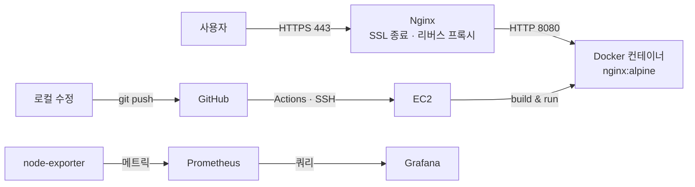

# myweb — AWS 인프라 구축부터 자동 배포·모니터링까지

EC2 한 대에 웹 서비스를 올리는 것부터 시작해,
HTTPS 적용 → 컨테이너화 → CI/CD 자동 배포 → 인프라 코드화 → 모니터링까지
직접 구축한 실습 프로젝트입니다.

**Live:** https://firstduck.duckdns.org

---

## 아키텍처

앞단 Nginx가 인증서와 라우팅을 전담하고, 실제 콘텐츠는 컨테이너가 담당합니다.
이 분리 덕분에 **컨테이너를 몇 번을 교체해도 인증서 설정은 건드릴 필요가 없습니다.**

---

## 기술 스택

| 영역 | 사용 기술 |
|---|---|
| 인프라 | AWS EC2, VPC, Elastic IP, Security Group, IAM Role |
| IaC | Terraform |
| 웹 서버 | Nginx (리버스 프록시 · SSL 종료) |
| 인증서 | Let's Encrypt + Certbot (90일 자동 갱신) |
| 컨테이너 | Docker, Dockerfile, nginx:alpine |
| CI/CD | GitHub Actions, SSH 배포 |
| 모니터링 | Prometheus, node-exporter, Grafana |

---

## 구현 내용

### 1. 인프라 · 보안
- EC2 프로비저닝, SSH 키 기반 접속
- Security Group 인바운드 최소 개방 (모니터링 포트는 특정 IP로 제한)
- Elastic IP로 고정 주소 확보 후 DNS A 레코드 연결
- Certbot으로 인증서 발급, HTTP → HTTPS 리다이렉트, 자동 갱신 타이머 검증
- **IAM Role 기반 AWS 인증** — 액세스 키를 서버에 저장하지 않음

### 2. 컨테이너
- Dockerfile로 이미지화 (`nginx:alpine` 기반, 69MB)
- 태그 기반 버전 관리로 **10초 내 롤백 가능**한 배포 체계
- `--restart unless-stopped` 정책으로 인스턴스 재기동 시 자동 복구

### 3. CI/CD
- `main` 브랜치 push를 트리거로 GitHub Actions 실행
- Secrets로 접속 정보 분리 (키를 코드에 노출하지 않음)
- 배포 전용 SSH 키를 별도 발급해 최소 권한 원칙 적용

### 4. Infrastructure as Code
- Terraform으로 VPC / 서브넷 / 인터넷 게이트웨이 / 라우팅 테이블 / 보안 그룹 / EC2 정의
- `user_data`로 부팅 시 Docker 설치 및 컨테이너 기동까지 자동화
- `plan` → `apply` → `destroy` 전체 사이클 검증
- **단일 명령으로 전체 환경 재현 가능**

### 5. 모니터링
- node-exporter로 서버 메트릭 노출 (CPU / 메모리 / 디스크 / 부하)
- Prometheus가 15초 주기로 수집, 설정은 볼륨 마운트로 외부 관리
- Grafana 대시보드 구성 (Node Exporter Full)
- **인위적 부하를 발생시켜 지표가 정상 반영되는지 검증**

**Grafana 대시보드 — CPU/메모리/디스크/네트워크 실시간 모니터링**

---

## 배포 흐름

1. 로컬에서 소스 수정
2. `git push origin main`
3. GitHub Actions 트리거
4. Actions가 EC2에 SSH 접속
5. `git pull` → `docker build` → 컨테이너 교체
6. 서비스 반영 (약 1분)

---

## 트러블슈팅

### 1. certbot이 server block을 찾지 못함
- **증상** `Could not automatically find a matching server block`
- **원인** Nginx `server_name`이 기본값 `_`여서 도메인 매칭 실패
- **조치** 실제 도메인으로 지정 → `nginx -t` 검증 → 무중단 `reload`

### 2. `proxy_pass directive is not allowed here`
- **증상** `nginx -t` 실패
- **원인** 주석 처리된 예시 server 블록 안에 설정을 추가해, 여는 `location {`이 무효화됨
- **조치** 실제 동작 중인 server 블록 내부로 이동
- **재발방지** 설정 추가 전 해당 구역이 주석인지 확인

### 3. 인스턴스 재시작 후 502 발생
- **증상** 호스트 Nginx는 정상인데 백엔드 응답 없음
- **확인** `docker ps -a`에서 `Exited (0)` — **종료 코드 0이므로 크래시가 아닌 정상 종료로 판단**
- **원인** 컨테이너에 재시작 정책이 없어 인스턴스 재부팅 후 자동 기동되지 않음
- **조치** `--restart unless-stopped` 적용 및 배포 스크립트에 반영

### 4. 배포 시 컨테이너 이름 충돌
- **증상** `Conflict. The container name "/web" is already in use`
- **원인** `docker stop` 실패 시 `|| true`로 넘어가 `rm`이 수행되지 않음
- **조치** `docker rm -f web || true` 단일 명령으로 변경

### 5. Prometheus가 node-exporter를 찾지 못함
- **원인** 컨테이너 내부의 `localhost`는 컨테이너 자신을 가리킴
- **조치** Docker 브리지 게이트웨이(`172.17.0.1`)를 대상으로 지정

---

## 개선 예정

- **보안** — GitHub Actions 접속을 위해 22번 포트를 전체 개방 중. AWS Systems Manager 또는 self-hosted runner로 전환 필요
- **무중단 배포** — 컨테이너 교체 중 짧은 다운타임 발생. 블루-그린 방식 적용
- **알림** — 현재는 대시보드 확인만 가능. Alertmanager로 임계치 알림 구성
- **오케스트레이션** — 단일 호스트 한계. Kubernetes 전환
